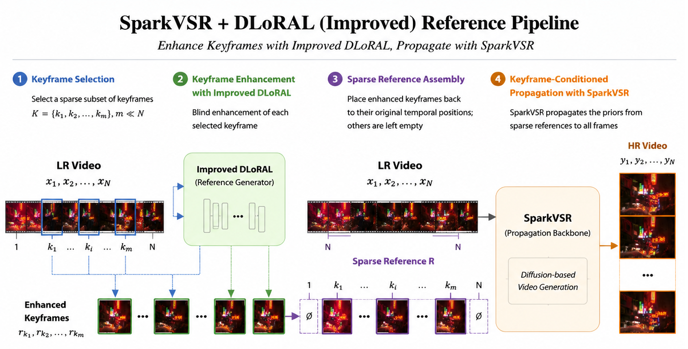
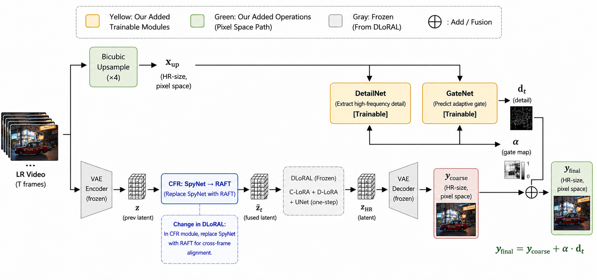

# DLoRA-Enhanced SparkVSR: Keyframe-Conditioned Video Super-Resolution

## Overview

This project integrates DLoRA (W4+SC) as a keyframe enhancer into SparkVSR's sparse-keyframe-conditioned VSR pipeline. DLoRA generates high-quality reference keyframes; SparkVSR propagates them to the full video. Three reference modes are supported: `no_ref` (blind), `pisasr` (PiSA-SR enhancement), and `dlora` (DLoRA W4+SC enhancement, our contribution).

## Directory Structure

```
submission/
├── README.md
├── sparkvsr_improved/        # SparkVSR with our modifications
│   ├── sparkvsr_inference_script.py   (*) modified: dlora ref_mode + SideChannel
│   ├── dloral_keyframe.py             (*) CLI wrapper for DLoRA single-frame SR
│   ├── side_channel/                  (*) SideChannel post-processing module
│   ├── run_eval_all.sh                evaluation launcher
│   ├── finetune/scripts/eval_all_metrics.py   evaluation core
│   └── requirements.txt               SparkVSR Python dependencies
└── dlora_improved/           # DLoRA W4+SC (code only, no weights)
    ├── src/                   core model + inference wrapper + CFR-RAFT
    └── ram/                   RAM semantic tagging model
```

(*) = files we created or modified.

## Dependencies

Two separate conda environments are required because SparkVSR and DLoRA need incompatible PyTorch versions.

### Environment 1: SparkVSR (main inference, torch 2.5.0)

```bash
conda create -n sparkvsr python=3.10
conda activate sparkvsr
pip install torch==2.5.0 torchvision==0.20.0 --index-url https://download.pytorch.org/whl/cu124
cd sparkvsr_improved && pip install -r requirements.txt
```

### Environment 2: DLoRA (keyframe enhancer, torch 2.0.1)

```bash
conda create -n lora python=3.10
conda activate lora
pip install torch==2.0.1 torchvision==0.15.2
pip install diffusers==0.25.0 transformers==4.28.1 accelerate xformers==0.0.20
pip install peft==0.9.0 open-clip-torch==2.20.0 einops Pillow PyYAML numpy
pip install mmcv==2.1.0 -f https://download.openmmlab.com/mmcv/dist/cu117/torch2.0/index.html
pip install mmengine==0.10.7 scipy
pip install 'setuptools<80'   # pkg_resources was removed in 80+
```

Adjust the mmcv wheel URL for your CUDA version. The example above is for CUDA 11.7.

### Additional packages for evaluation

```bash
conda activate sparkvsr
pip install pyiqa   # CLIPIQA, MUSIQ, LPIPS, DISTS
```

## Weights

All weights must be downloaded separately. Placeholder links below -- replace with actual download URLs.

### SparkVSR Model (~40 GB)

```
# Download from HuggingFace:
#   https://huggingface.co/JiongzeYu/SparkVSR
# Place at: sparkvsr_improved/checkpoints/SparkVSR/
```

### DLoRA W4+SC Weights

| File | Size | Link |
|---|---|---|
| model_52001.pkl (RAFT) | 3.3 GB | https://drive.google.com/file/d/12sg3vfzIdrECjpyjt0huypQThyCWLki6/view?usp=sharing |
| sidechannel_step005000.pt | 78 MB | https://drive.google.com/file/d/1k0Z_7BZRwjZ_CEXfOtSa4AJ6PhCGWSHA/view?usp=sharing |
| DAPE.pth (RAM finetune) | 7 MB | https://drive.google.com/file/d/1uJRzbKhP0fQlWCruYWg4HglXyaRoHNio/view?usp=sharing |
| stable-diffusion-2-1-base/ | 14 GB | https://huggingface.co/stabilityai/stable-diffusion-2-1-base |
| ram_swin_large_14m.pth | 5.3 GB | https://huggingface.co/spaces/xinyu1205/recognize-anything |


### Evaluation Metrics Weights

| File | Size | Link |
|---|---|---|
| DOVER.pth | 229 MB | https://huggingface.co/teowu/DOVER |
| FAST_VQA_3D_1_1.pth | 122 MB | https://github.com/TimothyHTimothy/FAST-VQA/releases/download/v2.0.0/FAST_VQA_3D_1_1.pth |
| swin_tiny_patch244_window877_kinetics400_1k.pth | 122 MB | https://github.com/SwinTransformer/storage/releases/download/v1.0.4/swin_tiny_patch244_window877_kinetics400_1k.pth |

## Usage

All commands assume weights are downloaded and environments are set up.

### 1. no_ref (blind VSR, baseline)

```bash
conda activate sparkvsr
cd sparkvsr_improved
CUDA_VISIBLE_DEVICES=0 python sparkvsr_inference_script.py \
    --input_dir datasets/test/UDM10/LQ-Video \
    --model_path checkpoints/SparkVSR \
    --output_path results/UDM10/no_ref \
    --is_vae_st --ref_mode no_ref --upscale 4
```

### 2. DLoRA reference mode (our main contribution)

```bash
export DLORA_HOME=/path/to/dlora_improved
conda activate sparkvsr
CUDA_VISIBLE_DEVICES=0 python sparkvsr_inference_script.py \
    --input_dir datasets/test/UDM10/LQ-Video \
    --model_path checkpoints/SparkVSR \
    --output_path results/UDM10/dlora \
    --is_vae_st --ref_mode dlora --ref_indices 0 --upscale 4 \
    --dlora_python /path/to/lora_env/bin/python \
    --dlora_script_path dloral_keyframe.py \
    --dlora_pretrained_path /path/to/model_52001.pkl \
    --dlora_sidechannel_ckpt /path/to/sidechannel_step005000.pt \
    --dlora_gpu 1
```

`DLORA_HOME` must point to the `dlora_improved/` directory. `dlora_python` must point to the `lora` conda environment's Python. `dlora_gpu` specifies which GPU the DLoRA subprocess uses.

### 4. Memory optimization for large videos

```bash
    --chunk_len 32 --tile_size_hw 512 640
```

### 5. Run evaluation

```bash
export HF_ENDPOINT=https://hf-mirror.com   # if HuggingFace blocked
bash run_eval_all.sh \
    --pred results/UDM10/dlora \
    --gt datasets/test/UDM10/GT-Video \
    --out results/UDM10/dlora \
    --metrics psnr,ssim,lpips,dists,clipiqa,musiq,dover,fastvqa \
    --gpu_id 0
```

## Results

Comparison of DLoRAL standalone variants and SparkVSR fusion variants. **Bold** = best, *italic* = second-best.

### UDM10 (10 clips, synthetic BD degradation)

| Config | PSNR↑ | SSIM↑ | LPIPS↓ | MUSIQ↑ | CLIPIQA↑ | DOVER↑ | FasterVQA↑ |
|---|---|---|---|---|---|---|---|
| DLoRAL baseline | 26.72 | 0.767 | 0.219 | **68.98** | **0.658** | **0.762** | 0.586 |
| *DLoRAL improved | *28.36* | *0.814* | *0.194* | 62.01 | *0.595* | *0.719* | 0.733 |
| SparkVSR no_ref | **29.66** | **0.868** | **0.147** | 59.57 | 0.454 | 0.618 | *0.805* |
| SparkVSR + DLoRAL, 1-kf | 26.73 | 0.790 | 0.225 | *67.93* | 0.593 | 0.687 | **0.841** |

### SPMCS (30 clips, mixed degradation)

| Config | PSNR↑ | SSIM↑ | LPIPS↓ | MUSIQ↑ | CLIPIQA↑ | DOVER↑ | FasterVQA↑ |
|---|---|---|---|---|---|---|---|
| DLoRAL baseline | *22.61* | *0.679* | **0.156** | 66.07 | **0.617** | **0.791** | 0.606 |
| *DLoRAL improved | **24.45** | **0.726** | **0.156** | 60.46 | 0.569 | *0.774* | *0.712* |
| SparkVSR no_ref | 18.99 | 0.490 | *0.220* | *67.57* | 0.545 | 0.498 | 0.703 |
| SparkVSR + DLoRAL, 1-kf | 18.67 | 0.460 | 0.266 | **70.18** | *0.607* | 0.490 | **0.738** |

DLoRAL standalone generally favors pixel-level fidelity, while SparkVSR fusion improves some video-oriented perceptual metrics. For DLoRA standalone results and keyframe-count ablation, see `eval_log.md`.

## Visualization

### Pipeline Overview



### DLoRA Optimization Flow




### Qualitative Comparison: Wild Video

- demo/wild-video.mp4
- demo/wild-video-SparkVSR+dlora.mp4

## Acknowledgement

- This project builds upon [DLoRAL](https://github.com/yjsunnn/DLoRAL) and [SparkVSR](https://github.com/taco-group/SparkVSR). We thank the authors for their excellent work and open-source release. 
- We also sincerely thank our course instructor **Prof. Hao Wang** for his guidance and support throughout this project.

